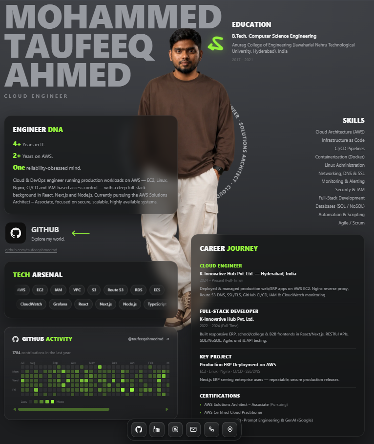

# Portfolio — Mohammed Taufeeq Ahmed

A poster-style personal portfolio and technical blog for a **Cloud / DevOps Engineer**,
built with **Next.js (App Router + TypeScript)** and **Tailwind CSS v4**, and deployed
on **Cloudflare Workers** via OpenNext.

🌐 **Live:** [iamtaufeeq.cloud](https://iamtaufeeq.cloud)



## Highlights

- **Poster-style landing page** — oversized display type, a cut-out portrait, animated
  GitHub activity, tech stack, and a career journey timeline.
- **Writing** — a content-driven blog (`/blog`) with native, theme-matched SVG diagrams
  (no raster images), rendered from typed data.
- **Projects** — case-study pages with architecture diagrams.
- **SEO built in** — per-page metadata, OpenGraph/Twitter cards, JSON-LD (Person, WebSite,
  BlogPosting, BreadcrumbList), an auto-generated `sitemap.xml` and `robots.txt`.
- **Fast & static** — pages prerender to static HTML; the wide diagrams are inline SVG/CSS.

## Tech stack

| Area | Stack |
| --- | --- |
| Framework | Next.js (App Router), React, TypeScript |
| Styling | Tailwind CSS v4 (`@theme` tokens in `app/globals.css`) |
| Hosting | Cloudflare Workers via `@opennextjs/cloudflare` + Wrangler |

## Getting started

```bash
npm install
npm run dev
```

Open http://localhost:3000.

## Add your photo

Drop a cut-out portrait into `public/` named `portrait.png`
(`.jpg` / `.jpeg` / `.webp` also work). It auto-replaces the center placeholder.
Use a full-body cut-out on a transparent/dark background for the poster look.

## Content & SEO

Everything is data-driven — add an entry to the relevant file and the page, listing,
sitemap, and structured data are generated automatically.

| Content | Where |
| --- | --- |
| Blog posts | `lib/blogs.ts` (`BLOGS` array) |
| Blog diagrams | `components/BlogDiagram.tsx` (referenced per section via `diagram`) |
| Projects | `lib/projects.ts` |
| Site + author metadata (name, keywords, JSON-LD) | `lib/site.ts` |
| Structured data (schema.org) | `lib/schema.ts` |

## Customize

| What | Where |
| --- | --- |
| Name, role, bio, stats | `app/page.tsx` |
| GitHub link / username | `app/page.tsx` |
| Tech stack pills | `app/page.tsx` (`TECH ARSENAL` array) |
| Experience / certifications | `app/page.tsx` (`CAREER JOURNEY` section) |
| Colors, fonts, animations | `app/globals.css` (`@theme` tokens) |

## Deployment (Cloudflare Workers)

The build targets Cloudflare Workers through OpenNext. Config lives in
`open-next.config.ts` and `wrangler.jsonc`.

```bash
npm run preview   # build + preview the Worker locally
npm run deploy    # build + deploy to Cloudflare
```

## Scripts

- `npm run dev` — dev server
- `npm run build:next` — plain Next.js production build
- `npm run build` — OpenNext (Cloudflare) build
- `npm run preview` — build and preview the Worker locally
- `npm run deploy` — build and deploy to Cloudflare
- `npm run lint` — lint
